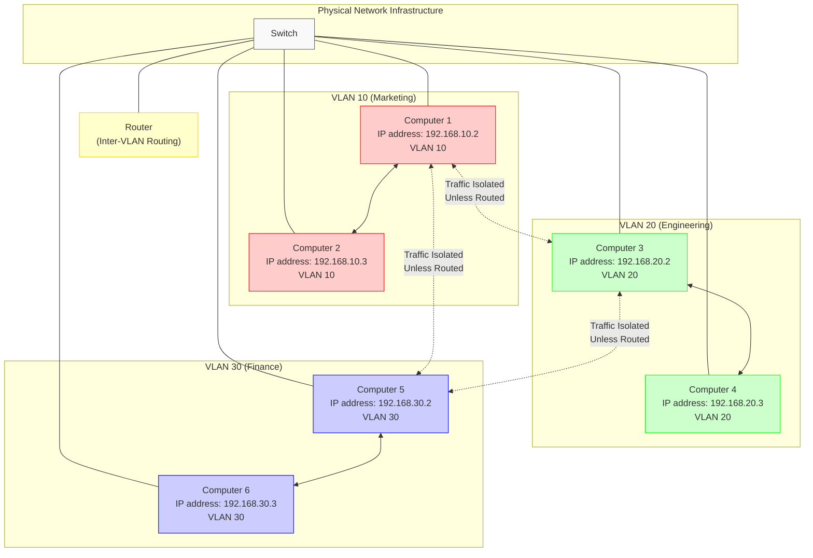

# Understanding VLANs and Their Operation

VLANs help us partition a LAN into smaller virtual networks for security
purposes. This allows us to have different logically distinct virtual networks
rather than having many physical small LANs.

Computers on the same network (LAN) communicate either through wireless access
points (AP) or through ethernet cables. All computers on a LAN are connected to
the same network switch.

## Types of VLANs

There are two types of VLANs:

- **Port-Based VLAN**: A VLAN is assigned to a particular port, and any machine
  connected to that port automatically joins that VLAN
- **User-Based or Dynamic VLAN**: VLANs are assigned based on user
  authentication or other dynamic criteria

## Network Architecture

