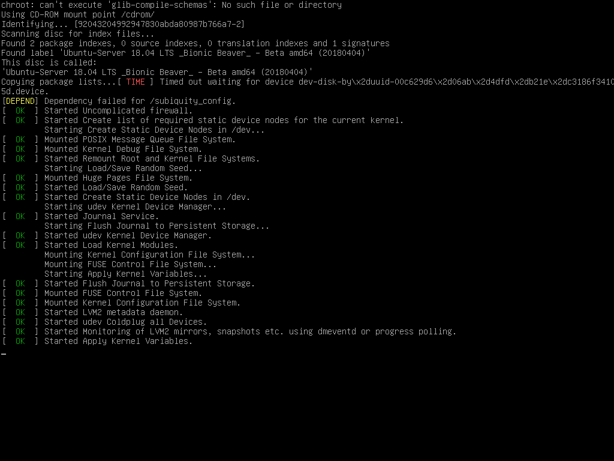

# HOW TO INSTALL A UBUNTU SERVER IN A MINI-PC

## 1.Overwiew

**What is ubuntu**

Ubuntu is one of the most widely used and popular Linux distributions, that comes in multiple editions including Ubuntu Desktop, Ubuntu Server, and Ubuntu Core to mention a few.

**Why ubuntu servers**
Ubuntu Desktop is a perfect choice for novices or users who are getting started out with Linux owing to its neat and intuitive user interface and default apps to help users get started.

Ubuntu Server is built for server environments, which is a lightweight and minimalistic version that is stripped off of any GUI applications and elements to enhance the speed and performance of running production-grade applications. It can serve as a web server, file server, development server, and DNS server to mention a few use cases.

**Why not other linus distros server**
 
The reason why we are using ubuntu server rather than other linus distros, is because ubuntu server is the most scalable linus distribution, it bring economic and technical scalability to your datacenter, public or private. Whether you want to deploy an Openstack cloud or Hadoop cluster or a 50,000-node render farm, ubuntu server deliver the best value scale-out performance available. What i mean by economic and technical scalability is that ubuntu can easily accomodate increased demand and usage.

Ubuntu works seamlessly across x86 and ARM. And it comes with all the leading open source and commercial workloads built in, including Apache Hadoop, Inktank Ceph, 10gen MongoDB and many others.

**What you'll need**

- ubuntu server image: [Downloading ubuntu server](https://ubuntu.com/download/server)

- Having a good flash or usb drive of atleat 4GB.
 
- Having the software called **balenaEtcher**: [Downloading balenaEtcher](https://etcher-docs.balena.io/).

**What you'll learn**

How you will make a ubuntu server bootable key and also how to install ubuntu server on a computer.

## 2. Get started
To make a bootable flash drive, you need an image and to do that you'll need a software like balenaEtcher: utility used for writing image to a storage device like USB drive, etc. We will use ubuntu server image, so click and the link above to download both **balenaEtcher** and **ubuntu server image**. Install balenaEtcher after download then:

1. launch balenaEtcher

click on the "balenaEtcher" icon to start balenaEtcher

2. locating the image file

click on "flash from file" to select your image file

3. choosing the storage device

click on "select target" to select your storage device

4. flash the USB drive

click on "flash" to make the bootable flash

**How to boot the machine**

TO trigger the installation process, perform the following:

1. plug the storage device to your computer
2. restart your computer

A few minutes later, you will see a message like this displayed on the screen...

If'd need assist to install the ubuntu server, follow the [installation guide](https://ubuntu.com/tutorials/install-ubuntu-server#3-boot-from-install-media).

If you are new to ubuntu server, we'd recommend reading the [server guide](https://documentation.ubuntu.com/server/)