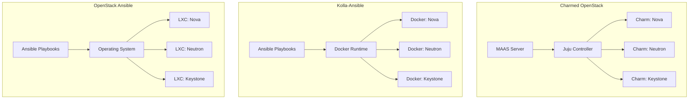
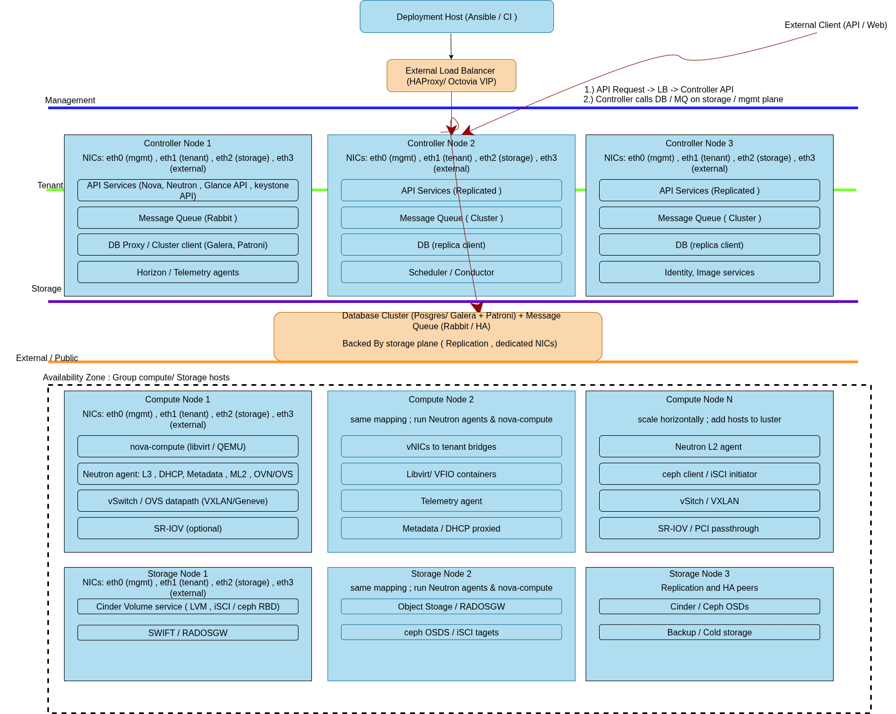

# OpenStack Deployment Technology Decision

## Introduction and Purpose

This document provides the technical rationale for selecting OpenStack
Ansible as our OpenStack deployment and lifecycle management solution. The
evaluation compares three primary deployment approaches: Charmed OpenStack
(MAAS + Juju), Kolla-Ansible, and OpenStack Ansible.

### Scope

This decision covers the deployment, configuration management, and
operational lifecycle of OpenStack infrastructure services. The scope includes
initial deployment, day-2 operations, upgrades, scaling, and troubleshooting
workflows.

**Target Scale**: This evaluation assumes a multi-node deployment with 3
controller nodes, 3-20 compute nodes, and 3 storage nodes, supporting
100-500 virtual machines in production.

**Deployment Mode**: OpenStack Ansible supports flexible deployment modes
configurable via inventory settings. Services can be deployed in LXC
containers (default) or directly on metal using the `is_metal: true`
property. This document assumes the default LXC container mode unless
otherwise specified. See [OpenStack Ansible Configuration Reference](
https://docs.openstack.org/openstack-ansible/latest/reference/inventory/configure-inventory.html)
for deployment options.

## Architecture Comparison Overview

The following diagram illustrates the abstraction layers and deployment
approaches for each technology:

## Deployment Architecture

### Architecture Overview

The deployment architecture implements a multi-tier OpenStack cloud with
clear separation of control plane, data plane, and storage services across
dedicated network planes. This design ensures optimal performance, security
isolation, and operational maintainability.

### Control Plane Components

**Controller Nodes (3x HA Cluster)**:

- Host all OpenStack API services (Nova, Neutron, Cinder, Glance,
  Keystone, Horizon)
- Run clustered database services (MariaDB Galera cluster)
- Operate message queue services (RabbitMQ cluster)
- Provide load balancing and API endpoint management
- Handle authentication, authorization, and service orchestration

**Load Balancer**:

- Distributes external API traffic across controller nodes
- Provides SSL termination and health checking
- Ensures high availability for all OpenStack APIs
- Routes dashboard (Horizon) traffic to active controllers

### Data Plane Components

**Compute Nodes (3-20x)**:

- Run Nova compute service for VM lifecycle management
- Host Neutron L2/L3 agents for tenant networking
- Execute hypervisor operations (KVM/QEMU)
- Provide local storage for ephemeral disks
- Connect to all network planes for VM traffic isolation

**Network Nodes (Optional/Integrated)**:

- Handle Neutron L3 routing and NAT services
- Provide DHCP services for tenant networks
- Manage floating IP assignment and external connectivity
- Can be integrated into controller or compute nodes

### Storage Plane Components

**Storage Nodes (3x)**:

- Provide Cinder block storage services
- Host Swift object storage services
- Manage persistent volume attachments to VMs
- Implement storage replication and backup services

### Network Plane Architecture

**Management Network**:

- Carries OpenStack API traffic between services
- Handles Ansible deployment and configuration management
- Provides SSH access and monitoring traffic
- Isolated from tenant and external networks

**Tenant Network (Overlay)**:

- Carries east-west VM-to-VM traffic within projects
- Implements VXLAN/GRE tunneling for network isolation
- Provides L2/L3 services through Neutron agents
- Scales to support thousands of tenant networks

**Storage Network**:

- Dedicated to Cinder and Swift storage traffic
- Carries iSCSI, NFS, or Ceph storage protocols
- Optimized for high throughput and low latency
- Isolated from other traffic types for performance

**External Network**:

- Provides north-south connectivity to internet/WAN
- Handles floating IP traffic and external API access
- Routes traffic through provider networks
- Connects to organizational network infrastructure

### Traffic Flow Patterns

**API Request Flow**:

1. External client → Load balancer → Controller node APIs
2. API service → Database cluster (MariaDB Galera)
3. API service → Message queue (RabbitMQ) → Target service
4. Response flows back through same path with load balancer distribution

**VM East-West Traffic**:

1. VM → Compute node Neutron agent → Tenant network overlay
2. VXLAN/GRE encapsulation across compute nodes
3. Neutron L2/L3 agents handle routing and switching
4. Traffic remains on tenant network plane throughout

**Storage I/O Flow**:

1. VM → Compute node → Storage network plane
2. Cinder volume attachment via iSCSI/NFS protocols
3. Storage nodes handle replication and backup
4. Swift object access through dedicated storage APIs

### High Availability and Redundancy

**Controller HA**:

- Active-active clustering for all API services
- MariaDB Galera 3-node cluster with automatic failover
- RabbitMQ cluster with message replication
- Load balancer health checks and automatic node removal

**Network Redundancy**:

- Multiple network paths for each plane
- Neutron agent failover for L3 services
- VRRP for gateway redundancy
- Bond interfaces for physical network resilience

**Storage Resilience**:

- Cinder volume replication across storage nodes
- Swift multi-replica object storage
- Backup and snapshot capabilities
- Cross-AZ storage distribution

### Document Maintenance Note

**Architecture Updates**: When the deployment architecture changes (new node
types, additional network planes, scale modifications, or service
relocations), update both this diagram and the corresponding explanation
sections. Version the diagram files and reference the commit hash in
deployment documentation.

**Deployment Mode Changes**: If the deployment mode changes from the default
LXC containers to bare-metal deployment (or vice versa), update both the
diagram annotations and all explanatory text sections to reflect the new
service deployment method. Update troubleshooting procedures and operational
workflows accordingly.

**Review Schedule**: Review architecture documentation quarterly and after
major OpenStack releases to ensure accuracy and alignment with operational
reality.

## Candidate Technology Overviews

### Charmed OpenStack (MAAS + Juju)

Canonical's Charmed OpenStack combines Metal-as-a-Service (MAAS) for bare
metal provisioning with Juju for application modeling and orchestration.
This approach uses charms (application packages) to deploy and manage
OpenStack services.

**Architecture**: Model-driven deployment using Juju controllers, charms for
service definitions, and MAAS for hardware lifecycle management. Services
are deployed as applications with defined relationships and configurations.

### Kolla-Ansible

Kolla-Ansible deploys OpenStack services using Docker containers
orchestrated through Ansible playbooks. It provides containerized OpenStack
services with standardized deployment patterns.

**Architecture**: Container-based deployment where each OpenStack service
runs in Docker containers. Ansible manages container orchestration,
configuration, and lifecycle operations.

### OpenStack Ansible

OpenStack Ansible deploys OpenStack services using Ansible playbooks and
roles with configurable deployment modes. Services can be deployed in LXC
containers (default) or directly on metal hosts using the `is_metal: true`
inventory property.

**Architecture**: Flexible deployment supporting both LXC containers and
bare-metal installation. In container mode (default), services run within
LXC containers managed by systemd. In metal mode (`is_metal: true`),
services run directly on the host using systemd. Configuration is managed
through comprehensive Ansible roles and inventory settings. See
[OpenStack Ansible Deployment Guide](
https://docs.openstack.org/project-deploy-guide/openstack-ansible/latest/)
and [Inventory Configuration Reference](
https://docs.openstack.org/openstack-ansible/latest/reference/inventory/configure-inventory.html)
for deployment options.

## Evaluation Criteria

The following criteria guided our technology selection:

- **Operational Transparency**: Visibility into service configuration,
  troubleshooting capabilities, and debugging workflows
- **Customization Flexibility**: Ability to modify configurations, integrate
  custom components, and adapt to specific requirements
- **Team Skill Alignment**: Match with existing team expertise in
  configuration management and infrastructure automation
- **Upgrade Path Complexity**: Simplicity and reliability of version upgrades
  and maintenance operations
- **Resource Overhead**: System resource consumption and performance impact
- **Community Support**: Documentation quality, community activity, and
  long-term viability
- **Integration Capabilities**: Compatibility with existing infrastructure
  automation and monitoring systems
- **Troubleshooting Complexity**: Ease of diagnosing and resolving
  operational issues

## Technology Comparison Matrix

| Criteria | Charmed OpenStack | Kolla-Ansible | OpenStack Ansible |
|----------|-------------------|---------------|-------------------|
| **Operational Transparency** | Medium - Juju abstracts | Low - Container limits | High - Direct access |
| **Customization Flexibility** | Low - Charm limited | Medium - Container custom | High - Full Ansible custom |
| **Team Skill Alignment** | Low - Juju expertise | Medium - Docker/Ansible | High - Existing Ansible |
| **Upgrade Complexity** | Medium - Charm deps | High - Container images | Medium - Ansible execution |
| **Resource Overhead** | Medium - Juju/MAAS | High - Docker (~15-20%) | Low-Medium - LXC (~2-5%) |
| **Community Support** | Medium - Canonical | Medium - Container focus | High - Broad OpenStack |
| **Integration Capabilities** | Low - Juju patterns | Medium - Container APIs | High - Native Ansible |
| **Troubleshooting Complexity** | High - Multi layers | High - Container network | Low - Direct access |

## Selected Approach and Rationale

**OpenStack Ansible is selected as our deployment technology.**

### Primary Rationale

**Operational Transparency**: OpenStack Ansible provides direct access to
service configurations, logs, and system state through lightweight LXC
containers. Services remain easily accessible via standard Linux tools
(systemctl, journalctl, ps) while maintaining isolation. This transparency
is critical for troubleshooting complex distributed systems and
understanding service behavior during incidents.

**Team Skill Leverage**: Our team has extensive Ansible expertise from
existing infrastructure automation. OpenStack Ansible builds on this
foundation rather than requiring new toolchain adoption (Juju/charms or
Docker orchestration patterns).

**Customization Requirements**: Our environment requires specific network
configurations, security hardening, and integration with existing monitoring
systems. OpenStack Ansible's role-based architecture allows granular
customization without fighting framework constraints.

**Debugging Simplicity**: When issues occur, OpenStack Ansible allows
direct investigation of service configurations, LXC containers, and
application logs without navigating complex container abstractions or Juju
model complexities. Services can be accessed directly via `lxc-attach` or
standard systemd commands.

### Specific Advantages Over Alternatives

**vs Charmed OpenStack**:

- Eliminates Juju learning curve and operational complexity
- Removes dependency on MAAS for environments with existing provisioning
- Provides direct configuration control without charm limitations
- Simplifies troubleshooting by removing model abstraction layers

**vs Kolla-Ansible**:

- Reduces resource overhead compared to Docker containers (LXC estimated
  ~2-5% memory per service vs Docker's estimated ~15-20% per node, to be
  validated in environment)
- Simplifies networking by avoiding Docker bridge networking complexity
  (LXC uses host networking with namespace isolation)
- Enables direct service debugging through lightweight containers (access
  via `lxc-attach` or host-level systemctl commands)
- Provides clearer upgrade paths without container image coordination (no
  image registry dependencies or Docker version conflicts)

## Risks, Trade-offs, and Mitigations

### Identified Risks

**Configuration Complexity**: OpenStack Ansible requires more detailed
configuration management compared to higher-level abstractions, with ~200+
configuration parameters across core services.

- **Mitigation**: Invest in comprehensive configuration templates, automated
  validation (ansible-lint, yaml validation), and configuration drift
  detection

**Service Dependency Management**: Manual coordination of service
dependencies during deployments and upgrades, requiring explicit ordering
of 15+ interconnected services.

- **Mitigation**: Implement thorough testing procedures, staged deployment
  processes with health checks, and automated rollback triggers

**Security Hardening Responsibility**: Direct responsibility for service
security configuration rather than framework defaults, including TLS
certificates, firewall rules, and service authentication.

- **Mitigation**: Develop security baseline configurations, automated
  compliance checking (OpenSCAP, custom Ansible security roles), and
  regular security audits

**Operational Learning Curve**: Team requires deep understanding of
OpenStack service internals and interdependencies.

- **Mitigation**: Invest in comprehensive training, detailed runbook
  development, and mentorship from OpenStack subject matter experts

### Accepted Trade-offs

**Higher Initial Configuration Effort**: More upfront investment in
playbook customization and testing compared to turnkey solutions.

**Manual Dependency Coordination**: Requires explicit service dependency
management rather than framework automation.

**Security Configuration Ownership**: Full responsibility for security
hardening rather than framework-provided defaults.

## Operational Implications

### Day-1 Operations

- Environment-specific configuration development using OpenStack Ansible's
  provided playbooks, roles, and helper scripts (estimated 2-4 weeks for
  customization)
- CI/CD pipeline integration leveraging OpenStack Ansible's
  `bootstrap-ansible.sh` and `run-playbooks.sh` automation
- Custom variable files and inventory configuration for organizational
  requirements
- Security baseline implementation and validation (CIS benchmarks,
  organizational security policies)
- Network topology validation and service endpoint testing
- Performance baseline establishment and capacity planning

### Day-2 Operations

- Direct service management: LXC container mode uses `lxc-attach` and
  systemctl within containers; metal mode uses direct systemctl on host
- Log aggregation and monitoring integration with minimal container
  complexity (direct syslog integration, native metric collection)
- Configuration drift detection and remediation through Ansible (scheduled
  compliance runs, automated remediation)
- Capacity monitoring and scaling operations (horizontal compute scaling,
  storage expansion)
- Backup and disaster recovery procedures (database backups, configuration
  snapshots)

### Upgrade Operations

- Ansible playbook-driven upgrade processes with automated pre-flight checks
- Service-by-service upgrade coordination and validation (rolling upgrades
  with health checks)
- Rollback procedures using configuration management state (automated
  rollback triggers, configuration versioning)
- Database migration coordination and validation
- Post-upgrade testing and validation procedures

### Troubleshooting Workflows

- Direct access to service logs and configurations: LXC mode via
  `lxc-attach` and container logs; metal mode via direct host access
- Native debugging tools and processes (strace, tcpdump, service-specific
  debugging)
- Clear service dependency and communication patterns (host networking with
  namespace isolation in LXC mode)
- Performance profiling and bottleneck identification
- Root cause analysis procedures with direct system access

## Validation and Acceptance Criteria

### Technical Validation

- [ ] Successful deployment of core OpenStack services across controller
      nodes with all services reporting healthy status
- [ ] Controller HA cluster operational: MariaDB Galera 3-node cluster,
      RabbitMQ cluster, load balancer health checks
- [ ] VM boot time < 60 seconds for standard instances (target to be
      validated in environment)
- [ ] API response times < 2 seconds for standard operations through load
      balancer (target to be validated)
- [ ] Network plane isolation verified: management, tenant, storage, and
      external networks properly segregated
- [ ] East-west VM traffic flows correctly through tenant network overlay
      (VXLAN/GRE) with < 1ms latency (target)
- [ ] North-south traffic routing functional through external network and
      floating IPs
- [ ] Storage I/O flows on dedicated storage network: Cinder IOPS > 1000
      (target), Swift throughput > 100MB/s (target)
- [ ] Integration with existing monitoring and logging infrastructure
      (Prometheus/Grafana, ELK stack)
- [ ] Security baseline implementation achieving 95% compliance with
      organizational security policies

### Operational Validation

- [ ] Team proficiency demonstrated: 100% of team members can execute
      standard deployment procedures independently
- [ ] Documented runbooks covering 15+ common operational scenarios
      (service restart, node replacement, capacity expansion)
- [ ] Successful execution of upgrade procedures in test environment with
      < 5 minutes downtime per service
- [ ] Integration with existing change management: automated deployment
      pipeline with approval gates
- [ ] Incident response time: P1 incidents acknowledged within 15 minutes,
      initial response within 30 minutes
- [ ] Configuration drift detection: automated scanning every 4 hours,
      remediation within 1 hour

### Performance Validation

- [ ] Controller node CPU utilization < 70% during normal operations
      (target baseline)
- [ ] Controller node memory utilization < 80% during normal operations
      (target baseline)
- [ ] Compute node overhead < 10% of total resources including LXC
      containers (target to be measured)
- [ ] Database response times < 100ms for 95th percentile queries (target
      to be validated)
- [ ] Message queue latency < 50ms for 95th percentile operations (target
      to be validated)
- [ ] Successful horizontal scaling: add compute node with < 10 minutes
      integration time (target)
- [ ] Network performance: tenant network throughput > 80% of physical
      network capacity (target)

### Long-term Validation

- [ ] Successful completion of first major version upgrade (OpenStack
      release) with < 30 minutes total downtime
- [ ] Effective incident response: 90% of incidents resolved using
      documented procedures and direct system access
- [ ] Team satisfaction survey: > 80% satisfaction with operational
      workflows and debugging capabilities
- [ ] Capacity planning accuracy: actual resource consumption within 15%
      of projections
- [ ] Security compliance: pass quarterly security audits with zero
      critical findings

### Failure Mode Testing

- [ ] Controller node failure: automatic failover within 2 minutes, load
      balancer removes failed node
- [ ] Database cluster failure: MariaDB Galera automatic failover within
      60 seconds, zero data loss
- [ ] Message queue failure: RabbitMQ cluster maintains service continuity
- [ ] Compute node failure: VM evacuation and restart within 5 minutes
- [ ] Network plane failure: traffic isolation maintained, no cross-plane
      contamination
- [ ] Storage node failure: Cinder/Swift replication maintains data
      availability, performance degradation < 20%
- [ ] Network partition: services continue operating in degraded mode,
      automatic recovery upon reconnection
- [ ] Load balancer failure: API services remain accessible through backup
      load balancer

## References and Documentation

### OpenStack Ansible Documentation

- [Official Documentation](https://docs.openstack.org/openstack-ansible/latest/)
- [Deployment Guide](https://docs.openstack.org/openstack-ansible/latest/user/index.html)
- [Operations Guide](https://docs.openstack.org/openstack-ansible/latest/admin/index.html)
- [Architecture Guide](https://docs.openstack.org/openstack-ansible/latest/reference/architecture/index.html)

### Charmed OpenStack

- [Charmed OpenStack Documentation](https://docs.openstack.org/charm-guide/latest/)
- [Juju Documentation](https://juju.is/docs)
- [MAAS Documentation](https://maas.io/docs)

### Kolla-Ansible Documentation

- [Kolla-Ansible Documentation](https://docs.openstack.org/kolla-ansible/latest/)
- [Kolla Documentation](https://docs.openstack.org/kolla/latest/)
- [Container Deployment Guide](https://docs.openstack.org/kolla-ansible/latest/user/quickstart.html)

### Supporting Documentation

- [OpenStack Installation Guide](https://docs.openstack.org/install-guide/)
- [Ansible Best Practices](https://docs.ansible.com/ansible/latest/user_guide/playbooks_best_practices.html)
- [OpenStack Operations Guide](https://docs.openstack.org/operations-guide/)
- [OpenStack Security Guide](https://docs.openstack.org/security-guide/)
