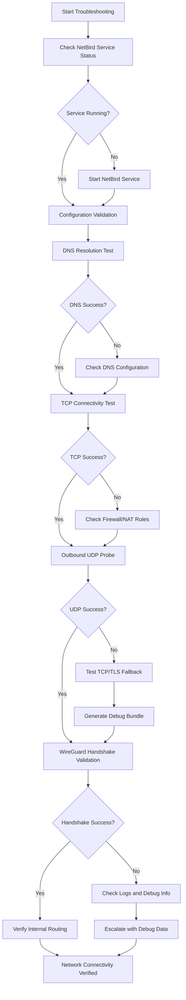

# NetBird Network Troubleshooting Guide

This guide provides comprehensive troubleshooting steps for NetBird network connectivity issues, focusing on outbound UDP traffic validation as specified in ticket #76.

**Purpose**: Document troubleshooting steps including validation of outbound UDP traffic and provide systematic approach to resolve NetBird connectivity issues.

## Troubleshooting Workflow



## Troubleshooting Steps

### 1. Check NetBird Service Status

```bash
# Check NetBird service status
sudo systemctl status netbird

# Check NetBird client status
netbird status

# Check detailed peer status with connection information
netbird status --detail
```

### 2. Configuration Validation

Validate NetBird configuration before proceeding with connectivity tests:

```bash
# Check NetBird version
netbird version

# Check detailed status including management server connection
netbird status --detail

# Look for configuration files in common locations
# For standard installations:
ls -la /etc/netbird/
# For Snap installations:
ls -la /var/snap/netbird/common/

# Verify management server connectivity from status
netbird status --detail | grep -E "(Management|Signal):"
```

**Configuration Checklist:**
- [ ] NetBird client version is current
- [ ] Management server shows "Connected" in status
- [ ] Signal server shows "Connected" in status  
- [ ] Configuration files exist in expected location
- [ ] TLS certificates are valid (for self-hosted instances)

**Note:** Configuration file paths vary by installation method:
- Standard/self-hosted: `/etc/netbird/config.json`
- Snap installations: `/var/snap/netbird/common/`

### 3. DNS Resolution Test

```bash
# Test DNS resolution for management server
dig +short api.netbird.io

# Test DNS resolution for signal server
dig +short signal.netbird.io

# Test STUN server resolution
dig +short stun.l.google.com
```

### 4. TCP Connectivity Test

```bash
# Test HTTPS connectivity to management server
curl -I --connect-timeout 10 https://api.netbird.io:443

# Test using netcat for basic connectivity
nc -zv api.netbird.io 443
```

### 5. Outbound UDP Traffic Validation

**Required Ports and Endpoints** (Reference: [NetBird Docs → FAQ → What firewall ports should I open](https://docs.netbird.io/about-netbird/faq)):

**NetBird Cloud Services:**
- **Management Server**: `api.netbird.io` - TCP/443
- **Signal Server**: `signal.netbird.io` - TCP/443
- **STUN Server**: `stun.netbird.io` - UDP/80,443,3478,5555
- **TURN Server**: `turn.netbird.io` - UDP/80,443 and TCP/443-65535
- **Relay Service**: `*.relay.netbird.io` - TCP/443

**Self-Hosted Requirements** (Reference: [NetBird Docs → Advanced Guide → Requirements](https://docs.netbird.io/selfhosted/selfhosted-guide)):
- **Management**: TCP/33073 (gRPC), TCP/33080 (HTTP API)
- **Signal**: TCP/10000 (gRPC API)
- **Dashboard**: TCP/80, TCP/443 (HTTP & HTTPS)
- **Coturn (STUN/TURN)**: UDP/3478 (listening), UDP/49152-65535 (dynamic relay range)

!!! warning "Port Conflict Warning"
    **Before starting the NetBird self-hosted dashboard**, check if Apache2, Nginx, or any other HTTP/HTTPS service is running on the same server — they may already occupy ports 80 and 443. To avoid conflicts:
    
    **Option 1**: Stop/disable the conflicting service:
    ```bash
    # For Apache2
    sudo systemctl stop apache2
    sudo systemctl disable apache2
    
    # For Nginx
    sudo systemctl stop nginx
    sudo systemctl disable nginx
    ```
    
    **Option 2**: Change the NetBird dashboard listening ports (e.g., 8080 for HTTP, 8443 for HTTPS) in your NetBird configuration and access the dashboard via `http://your-server:8080` or `https://your-server:8443`.

#### STUN Server Connectivity

```bash
# Test NetBird STUN server connectivity (multiple ports)
nc -u -v stun.netbird.io 3478 < /dev/null
nc -u -v stun.netbird.io 5555 < /dev/null

# Alternative using timeout
timeout 5 nc -u stun.netbird.io 3478 < /dev/null
echo $?  # Should return 0 for success

# Test fallback STUN servers
nc -u -v stun.l.google.com 19302 < /dev/null
```

#### TCP/TLS Fallback Testing

If UDP is blocked, NetBird can fall back to TCP/TLS via TURN servers:

```bash
# Test TURN server TCP connectivity
nc -zv turn.netbird.io 443

# Test TURN over TCP (if UDP fails)
curl -I --connect-timeout 10 https://turn.netbird.io:443
```

#### Packet Capture for UDP Analysis

```bash
# Capture UDP traffic on NetBird interface
sudo tcpdump -i wt0 -n udp

# Capture traffic to specific STUN server
sudo tcpdump -i any -n "host stun.l.google.com and udp port 3478"

# Monitor for TURN fallback traffic
sudo tcpdump -i any -n "host turn.netbird.io and tcp port 443"
```

### 6. WireGuard Status Check

```bash
# Show WireGuard interface status
sudo wg show

# Check NetBird peer status with detailed information
netbird status --detail
```

**Expected Output Example** (Reference: [NetBird Docs → Troubleshooting Client Issues → NetBird agent status](https://docs.netbird.io/how-to/troubleshooting-client)):

```
Peers detail:
server-a.netbird.cloud:
  NetBird IP: 100.75.232.118/32
  Public key: kndklnsakldvnsld+XeRF4CLr/lcNF+DSdkd/t0nZHDqmE=
  Status: Connected
  -- detail --
  Connection type: P2P
  Direct: true
  ICE candidate (Local/Remote): host/host
  ICE candidate endpoints (Local/Remote): 10.128.0.35:51820/10.128.0.54:51820
  Last connection update: 20 seconds ago
  Last Wireguard handshake: 19 seconds ago
  Transfer status (received/sent) 6.1 KiB/20.6 KiB
  Quantum resistance: false
  Routes: 10.0.0.0/24
  Latency: 37.503682ms

server-b.netbird.cloud:
  NetBird IP: 100.75.226.48/32
  Status: Connected
  -- detail --
  Connection type: Relayed
  Direct: false
  ICE candidate (Local/Remote): relay/host
  ICE candidate endpoints (Local/Remote): 108.54.10.33:60434/10.128.0.12:51820
  Last Wireguard handshake: 18 seconds ago

OS: darwin/amd64
Daemon version: 0.27.4
CLI version: 0.27.4
Management: Connected to https://api.netbird.io:443
Signal: Connected to https://signal.netbird.io:443
Relays: [stun:turn.netbird.io:5555] is Available
        [turns:turn.netbird.io:443?transport=tcp] is Available
NetBird IP: 100.75.143.239/16
Interface type: Kernel
Peers count: 2/2 Connected
```

**Key Status Indicators:**
- **Connection type**: `P2P` (direct) vs `Relayed` (via TURN server)
- **Direct**: `true` indicates direct peer connection, `false` uses relay
- **ICE candidates**: `host/host` (direct), `relay/host` (one peer via relay)
- **Last Wireguard handshake**: Should be < 2 minutes for active connections
- **Management/Signal**: Should show \"Connected to\" with HTTPS URLs

### 7. Firewall and NAT Configuration

```bash
# Check iptables rules
sudo iptables -L -n -v

# Check UFW status (Ubuntu)
sudo ufw status verbose
```

**Required Firewall Rules** (Reference: [NetBird Docs → FAQ → Outgoing ports](https://docs.netbird.io/about-netbird/faq)):

**For NetBird Cloud:**
- Allow outbound TCP/443 to `api.netbird.io`, `signal.netbird.io`
- Allow outbound UDP/80,443,3478,5555 to `stun.netbird.io`
- Allow outbound UDP/80,443 and TCP/443-65535 to `turn.netbird.io`
- Allow outbound TCP/443 to `*.relay.netbird.io`
- Allow traffic on NetBird interface (typically `wt0` or `nb-*`)
- Allow established and related connections for return traffic

**For Self-Hosted NetBird:**
- Allow outbound TCP/33073, TCP/33080 (Management)
- Allow outbound TCP/10000 (Signal)
- Allow outbound UDP/3478 and UDP/49152-65535 (Coturn STUN/TURN)

**Interface Names:** NetBird typically uses `wt0` (WireGuard) or `nb-*` interface names. Check with `ip link show` to verify actual interface names in your environment.

**Edge Cases and Advanced Troubleshooting:**

```bash
# Check for corporate firewall/proxy blocking
curl -v --proxy-header "Host: api.netbird.io" https://api.netbird.io

# Test from different network locations to isolate ISP blocking
# Check NAT traversal capabilities
netbird status --detail | grep -E "(Connection type|ICE|Relay)"

# Verify TURN relay usage when direct connection fails
netbird status --detail | grep "Relayed"
```

**NAT/Firewall Troubleshooting:**
- **Corporate Firewalls**: May block UDP entirely, requiring TURN over TCP
- **ISP Blocking**: Some ISPs block UDP on non-standard ports
- **Symmetric NAT**: May prevent direct P2P connections, forcing relay usage
- **Return Traffic**: Ensure stateful firewall allows return packets

## Common Issues

### DNS Resolution Failures
```bash
# Check DNS configuration
cat /etc/resolv.conf

# Test with different DNS servers
dig @8.8.8.8 api.netbird.io
```

### UDP Traffic Blocked
```bash
# Add firewall rules for UDP traffic
sudo ufw allow out 3478/udp
sudo ufw allow out 5349/udp
```

### WireGuard Interface Issues
```bash
# Restart NetBird service
sudo systemctl restart netbird

# Check kernel module
lsmod | grep wireguard
```

## Logging and Debug Information

### Log File Locations

```bash
# NetBird service logs
journalctl -u netbird -f

# NetBird client logs (if configured - path may vary by installation)
tail -f /var/log/netbird/client.log

# System logs for network issues
journalctl -f | grep -E "(netbird|wg|wireguard)"
```

### Generate Debug Bundle

**Reference:** [NetBird Docs → Troubleshooting Client Issues → Debug bundle](https://docs.netbird.io/how-to/troubleshooting-client)

```bash
# Create comprehensive debug bundle with system info
netbird debug bundle --anonymize --system-info

# Generate debug info for specific duration (recommended for connection issues)
netbird debug for 5m --system-info

# Upload debug bundle directly to NetBird support (version 0.43.1+)
netbird debug bundle --system-info --upload-bundle

# Check detailed peer connection information
netbird status --detail --json > netbird_debug_$(date +%Y%m%d_%H%M%S).json
```

**Debug Bundle Flags:**
- `--anonymize (-A)`: Anonymizes IP addresses and non-netbird.io domains
- `--system-info (-S)`: Includes network routes and interface information
- `--upload-bundle (-U)`: Securely uploads bundle to NetBird support (v0.43.1+)

**Debug Information Includes:**
- Peer connection types (P2P vs Relayed)
- ICE candidate information  
- WireGuard handshake timestamps
- Network interface configurations
- Route table information
- System network configuration

## Internal Network Verification

After establishing NetBird connection, verify internal networking:

```bash
# Check route table for NetBird routes
ip route show | grep wt0

# Test peer reachability within NetBird network
ping PEER_NETBIRD_IP

# Verify NetBird DNS resolution (if configured)
nslookup peer-hostname.netbird.cloud

# Check internal network connectivity
netbird networks list
netbird status --detail | grep -A5 "Routes:"
```

## Troubleshooting Checklist

- [ ] NetBird service is running (`systemctl status netbird`)
- [ ] Configuration is valid (version, management URL, setup key)
- [ ] DNS resolution works for management/signal servers
- [ ] TCP connectivity to port 443 successful
- [ ] UDP connectivity to STUN servers successful (ports 3478, 19302)
- [ ] Local firewall allows required traffic
- [ ] Corporate firewall/proxy allows NetBird traffic
- [ ] WireGuard interface is up and configured
- [ ] Recent handshakes with peers (< 2 minutes)
- [ ] NetBird shows “Connected” status
- [ ] Internal routes are established
- [ ] Peer-to-peer connectivity verified
- [ ] Debug bundle generated if issues persist

## Escalation Process

If issues persist after following this guide:

1. **Generate debug bundle**: `netbird debug bundle --system-info --anonymize`
2. **Upload bundle** (v0.43.1+): `netbird debug bundle --system-info --upload-bundle`
3. **Collect logs**: `journalctl -u netbird --since "1 hour ago" > netbird_logs.txt`
4. **Document symptoms**: 
   - Connection type (P2P vs Relayed)
   - ICE candidate types
   - Error messages from `netbird status --detail`
   - Network environment (corporate firewall, NAT type)
5. **Contact support**: 
   - Include debug bundle upload key or file
   - Attach logs and symptom documentation
   - Reference: [NetBird Community Support](https://github.com/netbirdio/netbird/discussions)
