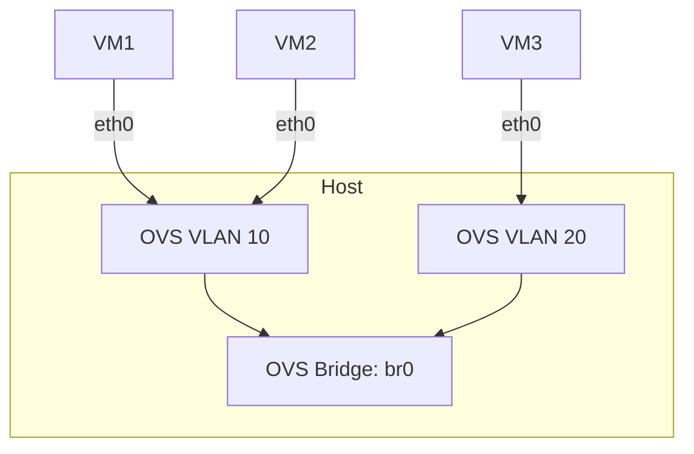

# Setting Up a Vswitch to connect Multipass instances

Hello guys in this tutorial we will configure a vswitch for multipass instances. And we are going to make our multipass instances to be accessible over the network.

## Launching a VM directly on a Vnetwork
    
Let's begin with the very basic step, launching a VM instance. But first make you have multipass installed. You can check it [here](https://canonical.com/multipass/install)
If we launch a vm instance without precising the network on which we want it to be connected, it will be connect on the default local network.

```sh
    multipass launch --name my-vm 24.04
```

Now lets launch different instances on the same network.

```sh
    multipass launch --name test-vm0 --network name=bridge0,mode=manual
    multipass launch --name test-vm1 --network name=bridge0,mode=manual
```

If you get an error with the above command, check if the bridge you are trying to connect to actually exist and is up or active. Or you create it yourself using one of the commands below

```sh
    sudo ip link add name bridge0 type bridge && ip link set bridge0 up # or
    sudo brctl addbr bridge0 && sudo ip link set bridge0 up # or
    sudo ovs-vsctl add-br bridge0 && ip link set bridge0 up 
```

Now lets see if our vms are connected on the same network. Because if they are connected, they should be able to ping each other.
We will configure a static ip for both machines and then ping them from the different virtual machines

```sh

multipass shell test-vm1  # to enter the test-vm1
sudo ip addr add 192.168.2.100 dev enp0s3 # use `ip a` to check if you are using the correct interface enp0s3 
```

```sh
    brctl show # to list all bridges and their status OR
    ovs-vsctl list-br # if working with openvswitch

```

Now lets inspect the ip of the network:

```sh
    multipass exec my-vm -- ip -br address show global
```

### 1. Creating/Selecting a driver for creating multipass VM.

A bridge is a software component acting as a virtual switch that enable us to connect multiple computers together on the same network.

On multipass, every vm that is created is either using lxdbr0 for lxd drivers or mpbr0 for qemu drivers.
The bridge allow vms to interact with each other as if they where on the same network.

To check the driver multipass is using to create VMs run.

```sh
    multipass get local.driver
```

To change the local driver run. But before runing this command make sure to stop all multipass instances running on the current driver if not the multipass daemon will fail.

```sh
    multipass stop instance1 instance2 instanceN
    multipass set local.driver=qemu
```

For more insights on [Multipass drivers](https://documentation.ubuntu.com/multipass/en/latest/explanation/driver/)

### 2. Creating/Selecting a network to add a VM

To list all available networks, run

```sh
    multipass networks
```

To set a default local network we run the following command:
```sh
    multipass set local.bridged-network=mpbr0
```

To connect you instance to the switch or on a particular network we first of all stop our multipass instances. And then we bridge the instance.

```sh
    multipass set local.<instance-name>.bridged=true
```

To change the network you simply change the network bridge above to the one you choose from `multipass networks`
And to check if the VM has being added successfully to the local network use

```sh
    multipass get local.<instance-name>.bridged
```

This is a simple architecture of a typical vnetwork
------



