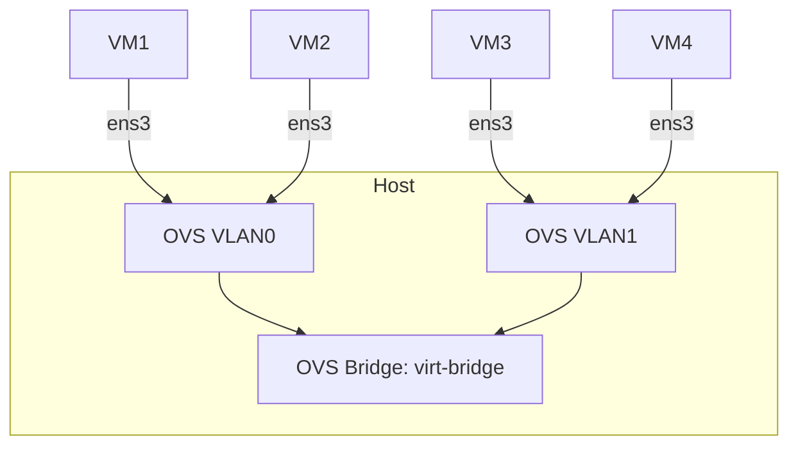

# How set up a vswitch (Virtual Switch) with Multipass?

Hello guys, in this tutorial we will configure a vswitch for Multipass instances. We are going to make our Multipass instances accessible over the network.

## What is a switch/bridge and why do we use it?

A switch is a networking device that helps us connect different computers together using ethernet cables. The switch has a MAC table that it uses to determine which computer on the network it is supposed to send data packets to. It is also one of the major component devices of layer 2 of the OSI model.

A bridge is a device that connects two or more local area networks (LANs) that use the same protocol. Bridges act the same way as switches (Virtual Switches in our case).

We are using a bridge here because our VMs are isolated from our host and we need to connect them so that they can talk with each other. A bridge allows the VMs to talk to each other as if they were on the same network.

## Main functions of a bridge

- Combines multiple VMs/Containers into a single logical network
- Maintains MAC address table to intelligently forward frames
- Allows devices on the same bridge to communicate directly (except when separated by VLANs)

## 1. Network Topology Overview



## 2. Prerequisites

To follow along in this course, you will need to:

- Have Ubuntu 22.04 LTS or Ubuntu 24.04 LTS
- Have [Multipass](https://canonical.com/multipass/install) installed
- Have root permission or use sudo if the user is in the sudoers group
- Have `ovs-vsctl` installed, for creating bridges and adding ports. One importance of OVS is that it supports virtual LAN technology that helps us split our virtual network into smaller logical partitions so that we can enforce security.

    ```sh
    sudo apt install -y openvswitch-switch
    ```

## 3. Creating a Virtual Network

After putting in place all those requirements, let's dive in!

- **First, we will create a Virtual Switch with VLAN support.**

    ```sh
    # Let's create Open Virtual Switch (OVS)
    sudo ovs-vsctl add-br virt-bridge
    ip link set virt-bridge up # to make it known to your system

    # Listing available bridges
    sudo ovs-vsctl list-br

    # Let's configure VLANs on the OVS
    sudo ovs-vsctl set port virt-bridge vlan_mode=native-untagged
    sudo ovs-vsctl set port virt-bridge trunks=0,1 # to allow VLAN0 and VLAN1
    ```

- **Now let's do a small trick: we are going to create 4 VMs and we will call them test-vmX where X is a variable.**

    ```sh
    # Creating VMs with a simple script
    for i in {1..4}; do
        multipass launch --name test-vm$i --network name=virt-bridge --network name=default 24.04
    done
    ```

    This will create 4 VMs with labels test-vm1, test-vm2, and so on, running Ubuntu 24.04.

- **Now let's configure the VLAN tag, which is a technology that uses the 802.1Q standard with a 12-bit tag added to the L2 packet before it is transmitted. It can only be decrypted by a machine connected on the same VLAN as it.**

  - To check which interface is available in your VM:

        ```sh
        multipass exec "test-vm1" -- ip -o link show | awk -F ': ' '!/lo/ {print $2; exit}' # repeat this command for the other VMs
        # If your interface is ens3, run the command; if not, replace ens3 with your own interface
        ```

  - Adding machines test-vm1 and test-vm2 to VLAN0:

        ```sh
        multipass stop test-vm1 test-vm2 # very important to be able to add ports
        sudo ovs-vsctl set port test-vm2-ens3 tag=0
        sudo ovs-vsctl set port test-vm1-ens3 tag=0
        multipass start test-vm1 test-vm2
        ```

  - Adding machines test-vm3 and test-vm4 to VLAN1:

        ```sh
        multipass stop test-vm3 test-vm4
        sudo ovs-vsctl set port test-vm3-ens3 tag=1
        sudo ovs-vsctl set port test-vm4-ens3 tag=1
        multipass start test-vm3 test-vm4
        ```

  - To check the different ports to see if they have been set:

        ```sh
        sudo ovs-vsctl show | grep -A 2 "Port"
        ```

  But we can automate all this bulky stuff, right? But that will be your assignment.

- **Now let's configure the network interfaces of the VMs and give them a static IP under a subnet so that they can talk to each other.**

  - For VLAN0, VMs are test-vm1 and test-vm2. Run these commands for both of them:

        ```sh
        multipass exec test-vmX -- sudo ip link set ens3 up
        sudo ip addr add 192.168.100.10X dev ens3
        ```

  - For VLAN1, VMs are test-vm3 and test-vm4. Run this for each of them:

        ```sh
        multipass exec test-vmX -- sudo ip link set ens3 up
        sudo ip addr add 192.168.200.10X dev ens3
        ```

- **Ah, finally we are done. Now let's test the connectivity and see if we have achieved what we wanted like in the architecture above.**

    ```sh
    # Testing connectivity
    multipass exec test-vm1 -- ping -c 5 192.168.100.102 # Should definitely work
    multipass exec test-vm2 -- ping -c 5 192.168.200.103 # Should definitely not work
    ```

Now let's talk about why we used a bridge and why it is advisable to configure a VLAN to split a network into logical smaller networks.

## Summary

In this tutorial we have seen:

- How to create a bridge
- How to add VMs to a network or bridge (note that we always stop the instance before attaching it to a network)
- How to create VLANs and how to add VMs to a VLAN
- How to set static IPv4 for our VM instances on the network
