# HOW TO INSTALL A UBUNTU SERVER 24.04 STEP-BY STEP

## Overview

**What is Ubuntu**

Ubuntu is one of the most widely used and popular Linux distributions, that comes in multiple editions including Ubuntu Desktop, Ubuntu Server, and Ubuntu Core to mention a few.

**Why Ubuntu servers**

Ubuntu Server is built for server environments, which is a lightweight and minimal version that is stripped off of any GUI applications and elements to enhance the speed and performance of running production-grade applications. It can serve as a web server, file server, development server, and DNS server to mention a few use cases.

# Ubuntu Server vs Other Server OS/Distros

| **Aspect**      | **Ubuntu Server**                                                                 | **Debian**                                                                          | **CentOS / RHEL**                                                                  | **Windows Server**                                                                   |
|-----------------|------------------------------------------------------------------------------------|-------------------------------------------------------------------------------------|------------------------------------------------------------------------------------|---------------------------------------------------------------------------------------|
| **Ability**     | Full-featured Linux server OS; supports wide range of services and apps           | Highly capable, but less user-friendly out of the box                               | Enterprise-focused capabilities; stable environments                               | Supports many enterprise tools, Active Directory, .NET, etc.                         |
| **Capacity**    | Easily supports heavy workloads with proper configuration                         | Handles large workloads, but tuning may require more expertise                      | Designed for enterprise-scale operations                                           | Capable of high capacity but with more resource overhead                             |
| **Performance** | Lightweight by default; minimal system load; high efficiency                      | Very lightweight; excellent performance, especially on older hardware               | Moderate; built for stability over raw performance                                 | Heavier footprint; performance affected by GUI and background services               |
| **Safety**      | Strong package integrity checks; frequent security patches                        | Conservative approach ensures safety, but slower update cycle                       | SELinux integration improves isolation and safety                                  | Closed-source; safety reliant on Microsoft’s update cycle                            |
| **Security**    | AppArmor, UFW firewall, automatic security updates available                      | Manual setup required for many security features                                    | SELinux is powerful but complex; good enterprise controls                          | Proprietary model limits transparency; patching is slower                            |
| **Scalability** | Well-suited for cloud environments, containers, and large-scale deployments       | Scalable, but lacks vendor-optimized tools for automation                           | Highly scalable; used in many large enterprise networks                            | Scales in enterprise settings but with higher resource and license costs             |                                                                                                                                               
**Prerequisites**
- Minimal 4 GB of RAM
- 2 GHz dual-core processor
- 25 GB disk space
- Internet Connectivity (Optional)
- Installation Media (bootable USB or DVD).

**What you'll learn**

How you will make a Ubuntu server bootable key and also how to install Ubuntu server 24.04 on a computer.

##  Get started

1. **Download the Ubuntu Server ISO Image**

The first step is to download the Ubuntu server 24.04 ISO image. So, head over to the official Ubuntu download page (https://ubuntu.com/download/server) and download the ISO file.
With the ISO file at hand, prepare the installation media by burning the ISO file into USB. You can use a software utility such as Rufus if you are running Windows or UNetbootin or balenaEtcher for Linux, macOS, and Windows. In this tutor we'll use balenaEtcher, get to the balenaEtcher page (https://etcher-docs.balena.io/) to download balenaEtcher, here are the steps to burn the ISO image:


i. launch balenaEtcher

    click on the "balenaEtcher" icon to start balenaEtcher.


ii. locating the image file

    click on "flash from file" to select your image file.


iii. choosing the storage device

    click on "select target" to select your storage device.
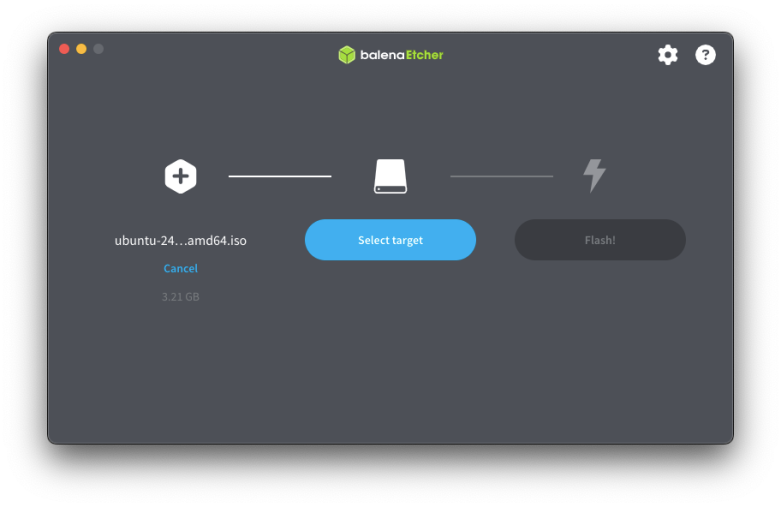

iv. flash the USB drive

    click on "flash" to make the bootable flash.


2. **Start Ubuntu Server Installation**

With the USB boot medium in place, plug it into the system you want to install the Ubuntu server OS and reboot. Be sure to configure your bootable medium to take the highest boot priority in the BIOS and continue booting.

Upon booting, you will see the GRUB menu with two options: “Try or Install Ubuntu Server” and “Test memory“. The first option comes pre-selected. This is what we want. So just hit ENTER to proceed.

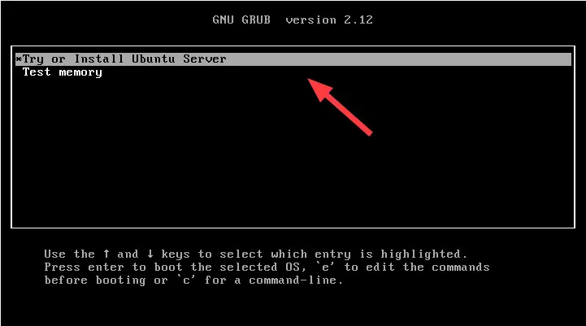

You will see some boot messages on the screen for a few seconds.


3. **Choose your language**

Once the system has finished booting, select your preferred installation language. By default, this is set to English. This looks good for our case, so hit ENTER to proceed to the next step
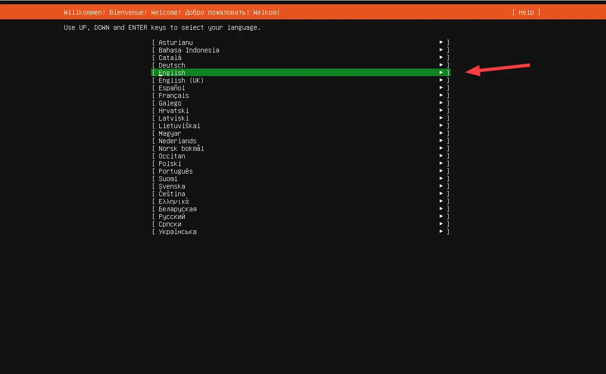

4. **Select Keyboard Layout**

Next, select your preferred layout. The default selection for the layout and variant is English (US). Feel free to select your preferred option, select `Done` with your arrow key, and hit ENTER to proceed to the next step.

[text](./images/image4.png)


5. **Choose the Type of Installation**

The next step will require you to select your preferred installation type. By default, the “Ubuntu Server” option is selected. In addition to that, you can also choose the “Ubuntu Server (“minimized”) option which is a version customized to have a small footprint in environments that do not require login by users.

In this guide, we will go with the “Ubuntu Server” option. 
So we will hit ENTER.

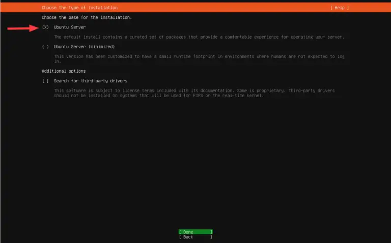

6. **configure network**

In this step, you need to configure at least one active interface for network and internet connection. Active connections will be displayed with corresponding IPv4 addresses since DHCP is selected by default.

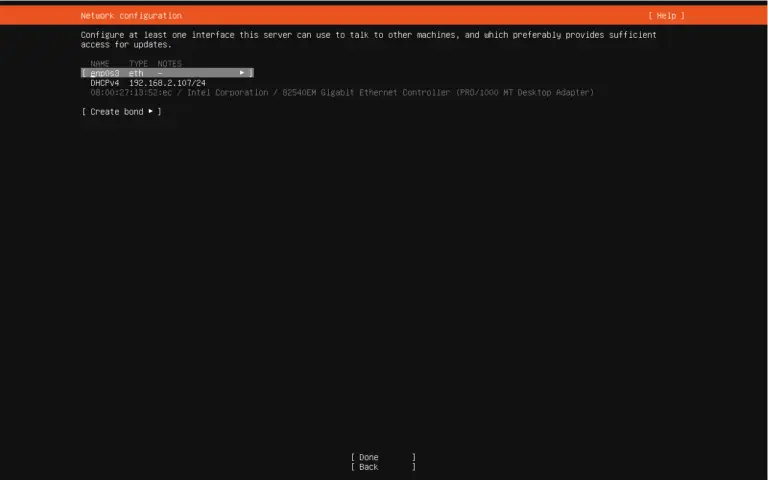

In our setup, “enp0s3” is the only active network interface. Instead of DHCP, we will configure a static IP address since the instance will act as a server.

So, ensure your active interface is selected, then hit the arrow-right key on the keyboard, and on the menu that appears, select `Edit IPv4` using the arrow-down key.

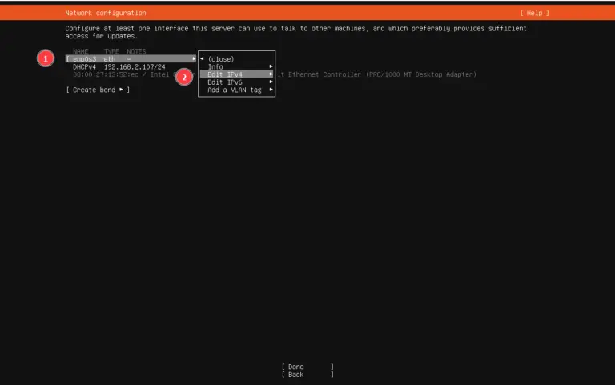

On the pop-up CLI that appears, select the `Manual` option and hit ENTER.

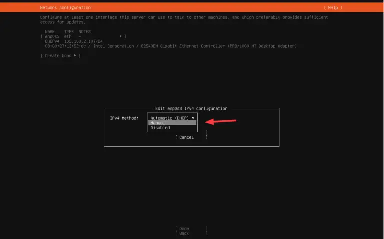

Be sure to fill in the IP details, i.e. Subnet, IP address, gateway, Nameservers, and Search domains, if any.  Then select `Save` and hit ENTER.

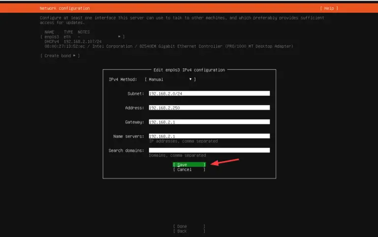

Next, select `Done` and hit ENTER.

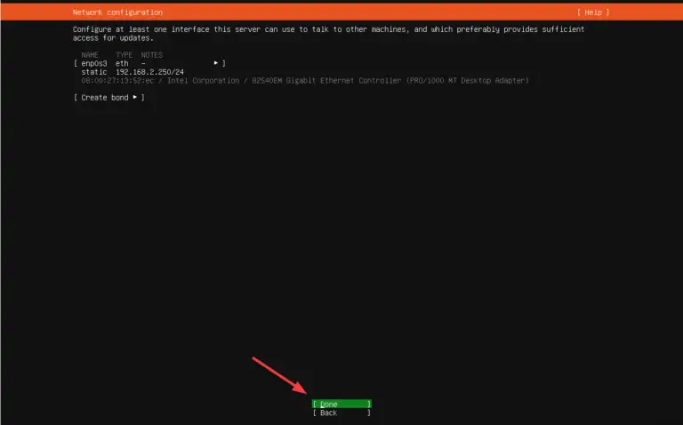

7. **Configure Proxy**

If you intend to connect to a Proxy server, here’s the chance to provide your Proxy server address. If you are not running a proxy server, leave it blank and hit `Done`. 


The installer will perform a mirror test by updating the package index. The default mirror address is http://archive.ubuntu.com/ubuntu/ which is just fine. You can also provide an alternative mirror instead of the default one.

Once the mirror test is complete, select `Done` and hit ENTER.

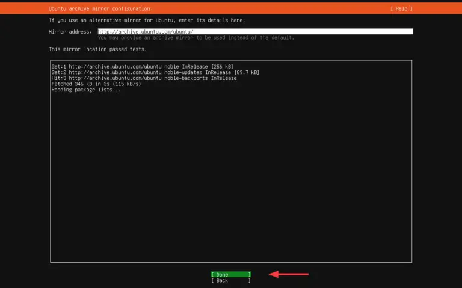

In this step, you will be required to configure disk partitions. By default, guided storage is selected. This auto-partitions your hard drive using the most recommended settings based on the size of your drive.

The other option – “Custom storage layout” – lets you manually specify the partitions including the partition type and size.

For simplicity, we will go with the first option – “Guided storage layout“. With this option selected, installer will intelligently partition the disk for you and allocate space for swap, /boot, and / ( root ) partitions.

Select `Done` and hit ENTER.

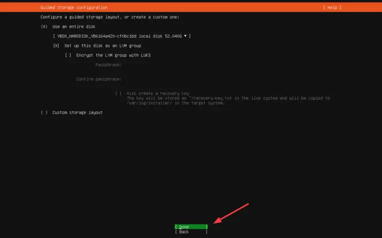

The partition table will be displayed next. If all looks good, select `Done` and hit ENTER. Otherwise, if you need to make some changes, select `Reset` and hit ENTER to head back and make the needed adjustment.

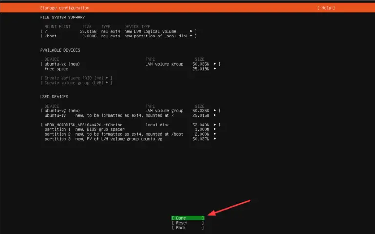

On the pop-up window that appears, select `Continue` and hit ENTER to write the changes to disk.


9. **Create a User Account**

Next, you will be required to create a user account. So, provide the required details including your name, the server’s name, username, and password, and hit ENTER to move to the next step.

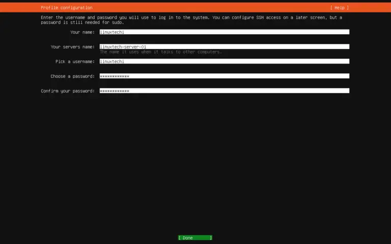

10. **Select whether to enable Ubuntu Pro**

Ubuntu Pro is an additional service on top of Ubuntu that provides extended support and maintenance including compliance for your OS. It provides 10 years of paid support and you can use up to 5 devices free for personal use. This, however, requires a Ubuntu One account.

For now, we will skip this – You can enable it later. So hit `Continue`. 

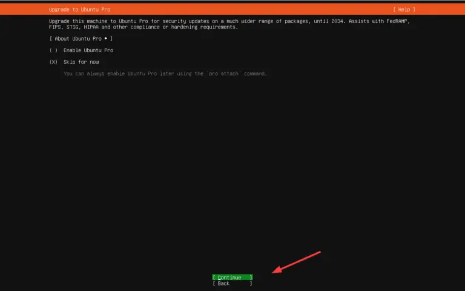

11.  **Select Whether to install the OpenSSH server & additional software**

Next, select whether you want to install the OpenSSH server which will allow remote login to the server. In our case, we will select to install it. Once selected, select `Done` and hit ENTER.

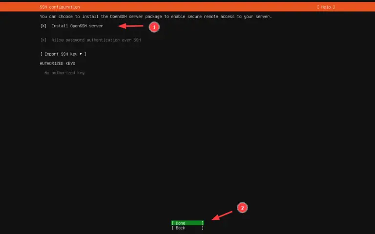 

Next, you will be required to select whether to install some featured applications in the form of snaps. So go through the list and enable your preferred snap. Alternatively, you can skip and install them later.

For now, we will not install snaps. So select `Done` and hit ENTER.

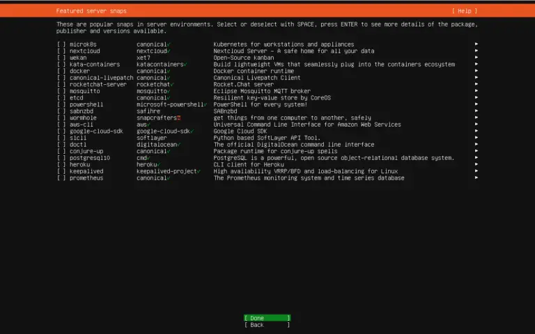

12. **Finish the Installation and Reboot**

From here, the installer will copy all the files from the bootable medium install them on your hard drive, and configure all the required settings.

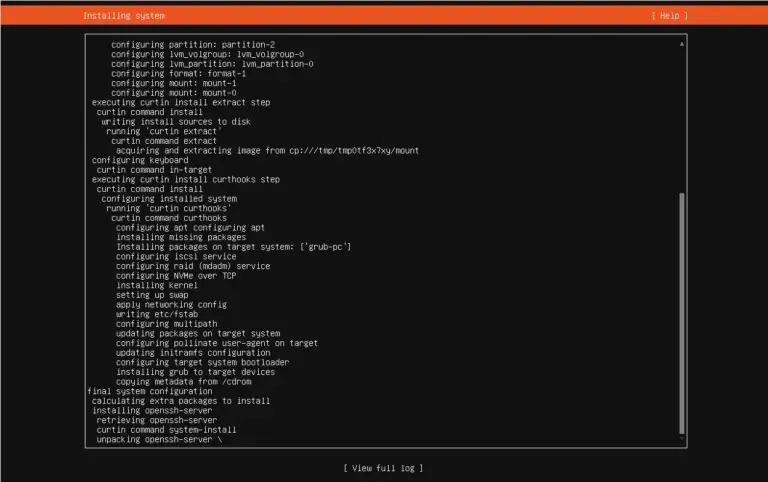

Finally, select `Done` and hit ENTER to reboot.

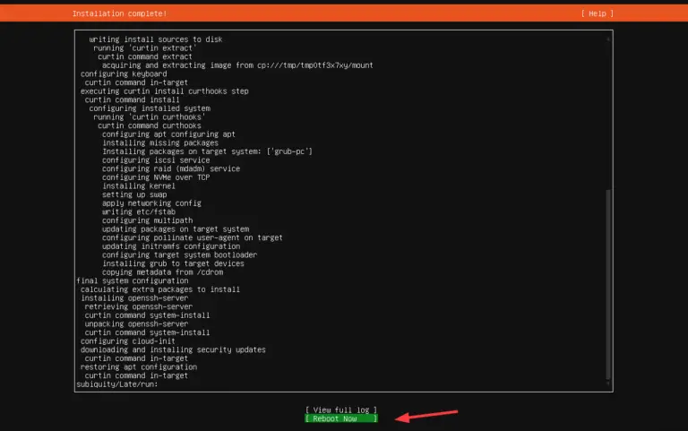

Once the system has rebooted, provide your user account’s password and hit ENTER to log in.

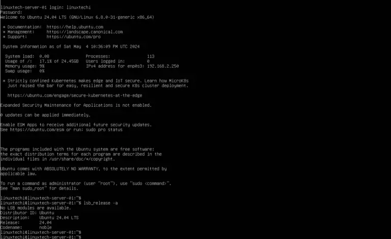

From now you can enjoy your Ubuntu server 24.04 LTS installation.
If you are new to Ubuntu server, we'd recommend reading the [server guide](https://documentation.ubuntu.com/server/)

## Security measures
 When installing an Ubuntu Server, several security considerations are important to ensure the system's safety. some steps are as follows:

 1. Ensuring that the system is updated regularly to apply the latest security patches and bug fixes.
 2. Using a firewall, such as Uncomplicated Firewall(ufw), to only allow necessary ports is also essential.
 3. securing shared memory by adding specific configurations to /etc/fstab can improve security.
 4. securing SSH service.
 5. Lastly, it is recommended to install security tools like Fail2ban to monitor and block malicious login attempts and to use security-enhancing features like AppArmor to restrict application permissions.

## Troubleshooting partition issues

If by the end while terminating the installation you get any error, then it means that you have a partition issue, and this is how you can resolve it:

1- Download the Ubuntu 24.04 ISO image from the official Ubuntu website.

2- Write the ISO image to a USB stick using a tool like balenaEtcher or the Startup Disk Creator.

3- Boot your machine from the USB stick. You may need to enter the boot menu (commonly accessed with F12, Escape, F2, or F10) to select the USB device as the boot device.

4- Once the USB boots, select the "Try Ubuntu" option from the GRUB bootloader.

5- Choose your language and follow the installation wizard's instructions. If you encounter issues with graphics, select "safe graphics" mode.

After your desktop environment has been setup, press "Ctrl + alt + t" to open a new terminal session.

1- Identify the target disk

Run:

```sh
lsblk
```

Example output:

```
NAME   MAJ:MIN RM  SIZE RO TYPE MOUNTPOINT
sda      8:0    0  500G  0 disk
├─sda1   8:1    0  100G  0 part /
├─sda2   8:2    0  400G  0 part /home
sdb      8:16   0  250G  0 disk
```

Suppose `sdb` is the disk you want to wipe and repartition.

---

###  Using `fdisk` (for MBR/GPT)

#### 2. Launch `fdisk`

```bash
sudo fdisk /dev/sdb
```

---

#### 3. Inside `fdisk` (interactive mode)

Press keys as prompted:

1. **Type `g`** to create a new GPT partition table (or `o` for MBR).
2. **Type `d`** to delete partitions (repeat until they're all gone).
3. **Type `n`** to create a new partition.
4. **Type `w`** to write changes and exit.

Sample flow:

```
Command (m for help): g
Created a new GPT disklabel.

Command (m for help): d
(No partition is currently defined, skip if none)

Command (m for help): n
Partition number (1-128, default 1): <Enter>
First sector (2048-...), default 2048: <Enter>
Last sector, +sectors or +size{K,M,G,T,P}: <Enter>

Command (m for help): w
```

---

#### 4. Format the new partition

Assuming it created `/dev/sdb1`, format it:

```bash
sudo mkfs.ext4 /dev/sdb1
```

(Use `mkfs.xfs` or `mkfs.ntfs` if you prefer other filesystems.)

---

#### 5. Mount it (optional)

```bash
sudo mkdir /mnt/newdisk
sudo mount /dev/sdb1 /mnt/newdisk
```

To mount it automatically at boot, you'd edit `/etc/fstab`.


