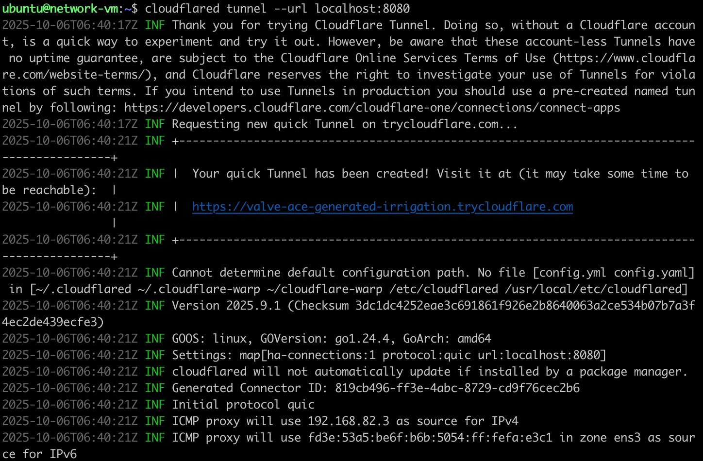

# Integrating NetBird With Wazuh

Wazuh is a SIEM and event logger system that is used to monitor systems for
networks vulnerabilities, file integrity and also monitor logs for suspicious
events on a system.

NetBird is a zero trust VPN that is built on top of WireGuard which is used to
create secure and encrypted tunnel for peer-to-peer connection and communication
over a network.

- NetBird is an easy to use interface that help you to use the WireGuard
  protocol directly without all the complexities of configuring them.
- WireGuard protocol is also lightweight and more secured as compared to other
  VPN technologies like OpenVPN.

NetBird has two monitoring functions that helps it to keep track of all what is
going on in the network.

## 1. Audit Event

This is used to monitor the activities and events that are occurring in the
NetBird network, like a **new user being added, a new instance or peer joining
the network, new setup-key created, updated policy or policy created** etc.

## 2. Traffic Event

This is used to monitor how traffic flows within the netbird network and it
also helps us to track who is making what request to who.
It can help us to see who is making bruteforce request and any attempt to masqurate.
I track all failed attempt to connect to different peers in the network.

### This is a full list of events tracked by NetBird

- **Peer Management:**
  - Peer added by user
  - Peer added with setup key
  - Peer removed by user
  - Peer renamed
  - Peer SSH server enabled
  - Peer SSH server disabled
  - Peer login expiration enabled
  - Peer login expiration disabled

- **User Management:**
  - User joined
  - User invited
  - User role updated
  - User blocked
  - User unblocked
  - User deleted

- **Group Management:**
  - Group created
  - Group updated
  - Group deleted
  - Group added to peer
  - Group removed from peer
  - Group added to user
  - Group removed from user
  - Group added to setup key
  - Group removed from setup key
  - Group added to disabled management DNS setting
  - Group removed from disabled management DNS setting
- **Policy Management:**
  - Policy added
  - Policy updated
  - Policy removed
- **Rule Management:**
  - Rule added
  - Rule updated
  - Rule removed
- **Setup Key Management:**
  - Setup key created
  - Setup key updated
  - Setup key revoked
  - Setup key overused
- **Route Management:**
  - Route created
  - Route removed
  - Route updated
- **Account Management:**
  - Account created
  - Account peer login expiration duration updated
  - Account peer login expiration enabled
  - Account peer login expiration disabled
  - Account peer approval enabled
  - Account peer approval disabled
- **Nameserver Group Management:**
  - Nameserver group created
  - Nameserver group deleted
  - Nameserver group updated
- **Token Management:**
  - Personal access token created
  - Personal access token deleted
- **Service User Management:**
  - Service user created
  - Service user deleted
- **Integration Management:**
  - Integration created
  - Integration updated
  - Integration deleted
- **Other Events:**
  - Transferred owner role
  - Posture check created
  - Posture check updated
  - Posture check deleted
  - User logged in peer
  - Peer login expired
  - Dashboard login

_This reference will take you to the integration of NetBird with SIEMs
[NetBird + SIEM](https://docs.netbird.io/how-to/activity-event-streaming)_

- I installed Wazuh and wanted to make the NetBird cloud forward the logs to my
  Python server so that it can write it in a file that Wazuh can monitor.
- This is the script to monitor.

```sh
# this is the command to install wazuh
curl -sO https://packages.wazuh.com/4.13/wazuh-install.sh && sudo bash ./wazuh-install.sh -a
```

After this command you will see the login credentails and the url to your netbird dashboard
or just your localhost or machine ip on port 143.

- But I could not because I needed to give my VM a public IP or domain name before
  I could do that.

- And also to self-host NetBird, you need to have a public domain name or public IP.
But the self-hosted version of netbird does not allow for event streaming that is
to monitor the traffic and activities of the netbird using a third party SIEM.

So I thought of using a free domain name provider that will make me incure no cost.

- Now I found that most of these domain name providers actually have a free tier
  that is limited and will only work for testing purposes.

- But I found this:

  `Instead of a true public IP, you can use a tunneling service to expose a local
  web server running inside your Multipass VM to the public internet. This approach
  is free and widely used for development and testing.`

- And the best one that suits for this purpose is using a Cloudflare tunneling
  service that will actually give us a fake public IP that we can somehow use

I use Cloudflare to create a public domain name that my NetBird cloud could use
to forward messages to my Python server listening on port 8080.

#### This is the setup of using Cloudflare

- Start by installing Cloudflare

```sh
 curl -L https://github.com/cloudflare/cloudflared/releases/latest/download/cloudflared-linux-amd64.deb -o cloudflared.deb
 sudo dpkg -i cloudflared.deb
```

- Then log in and you will be redirected or else you will see a redirection URL
to log in or create an account if you don't have one.

 ```sh
  #this is the command to login
  cloudflared tunnel login
 ```

- Then after that you need to create a temporary trycloudflare-endpoint or
   domain name with the port you want to listen to and only that port will be
   exposed when it is up.

 ```sh
 cloudflared tunnel --url http://localhost:8080
 ```

- Next you will see it at the top of the logs that will be displayed.



  ```sh
  2025-09-24T08:18:05Z INF Requesting new quick Tunnel on trycloudflare.com...
  2025-09-24T08:18:12Z INF +--------------------------------------------------------------------------------------------+
  2025-09-24T08:18:12Z INF |  Your quick Tunnel has been created! Visit it at (it may take some time to be reachable):  |
  2025-09-24T08:18:12Z INF |  https://sporting-goodtolook-thing-builder.trycloudflare.com                                 |
  2025-09-24T08:18:12Z INF +------------------------------------------------------+
  ```

- I wrote a Python script to receive incoming logs on that port 8080 and the
  servers was up when I ran it. So ensure that the server is up before you run
  `cloudflared tunnel --url` command.
  
- I took this URL `https://sporting-goodtolook-thing-builder.trycloudflare.com`
  and added in the URL section in the Generic HTTP function on NetBird so my
  logs can be forwarded.
- Allow all the servers to be running until you are done

#### Integrating with Wazuh

Now Wazuh that you deployed just needs to monitor the file where you are
forwarding the logs to.

- I edited a few files and added some extra content to include my logs to be
  monitored.
  
```xml
<!-- 
sudo nano /var/ossec/etc/ossec.conf
add the following content in the <ossec_config> section.
 -->
<localfile>
  <log_format>json</log_format>
  <location>/var/log/netbird/activity.json</location>
</localfile>

<!-- this one is for other files that needs to be monitored -->
<localfile>
  <log_format>syslog</log_format>
  <location>/var/log/netbird/client.log</location>
</localfile>
<localfile>
  <log_format>syslog</log_format>
  <location>/var/log/netbird/netbird.err</location>
</localfile>
<localfile>
  <log_format>syslog</log_format>
  <location>/var/log/netbird/netbird.out</location>
</localfile>
```

- Now I check the permission of those files and make sure that Wazuh has the
  right to read them

```sh
ls -l /var/log/netbird/
sudo usermod -aG root wazuh
```

- I used default decoders and configured rules  so that they can be able
to throw alert messages for some events that will happen like changing
or adding new policy, setup key deleted or created. When these rules are met,
an alert is being fired to my email.

```xml
<group name="netbird,">
  <rule id="100000" level="5">
    <decoded_as>json</decoded_as>
    <field name="Message">peer ssh server disabled</field>
    <description>NetBird SSH access for a peer has been disabled.</description>
  </rule>

  <rule id="100002" level="7" overwrite="yes">
    <field name="Message" type="pcre2">^setup key deleted</field>
    <description>NetBird setup key deleted by user.</description>
  </rule>
</group>

```

- After which I restarted the Wazuh manager and that was it

```sh
sudo systemctl restart wazuh-manager
```


I then went to the Wazuh dashboard under the discover section and I found the
logs from Wazuh and my local machine where the server is running.

Wazuh Security Events only display messages on the dashboard that are triggered
by rules.


Without a rule, the NetBird logs exist in the raw archives but will not be
considered "security events." and so will be discarded after some time to save
space for events that need to be displayed on the Wazuh dashboard since this
Wazuh is for monitoring critical events.

This thing is becoming serious I have done some little modifications in the
`/var/ossec/etc/rules/local_rules.xml` file and it worked.
Now I have configured my email according to the documentation of Wazuh to act
as a relay host so that it can be used to forward emails to users that I specify
in the `<email_to>` tag under the `<global>` section of the `<ossec_config>`.

[Alerting on Wazuh](https://documentation.wazuh.com/current/user-manual/manager/alert-management.html)

This is the config file used to configure relayhost for wazuh to use to forward email.

```sh

##filename  /etc/postfix/main.cf

# See /usr/share/postfix/main.cf.dist for a commented, more complete version


# Debian specific:  Specifying a file name will cause the first
# line of that file to be used as the name.  The Debian default
# is /etc/mailname.
#myorigin = /etc/mailname

smtpd_banner = $myhostname ESMTP $mail_name (Ubuntu)
biff = no

# appending .domain is the MUA's job.
append_dot_mydomain = no

# Uncomment the next line to generate "delayed mail" warnings
#delay_warning_time = 4h

readme_directory = no

# See http://www.postfix.org/COMPATIBILITY_README.html -- default to 3.6 on
# fresh installs.
compatibility_level = 3.6


# TLS parameters
smtpd_tls_cert_file=/etc/ssl/certs/ssl-cert-snakeoil.pem
smtpd_tls_key_file=/etc/ssl/private/ssl-cert-snakeoil.key
smtpd_tls_security_level=may

smtp_tls_CApath=/etc/ssl/certs
smtp_tls_security_level=may
smtp_tls_session_cache_database = btree:${data_directory}/smtp_scache


smtpd_relay_restrictions = permit_mynetworks permit_sasl_authenticated defer_unauth_destination
myhostname = network-vm.tail431420.ts.net
alias_maps = hash:/etc/aliases
alias_database = hash:/etc/aliases
myorigin = /etc/mailname
mydestination = $myhostname, netbird-noreply@wazuh.com, network-vm, localhost.localdomain, localhost
#relayhost =
mynetworks = 127.0.0.0/8 [::ffff:127.0.0.0]/104 [::1]/128
mailbox_size_limit = 0
recipient_delimiter = +
inet_interfaces = all
inet_protocols = all

# Relay settings
relayhost = [smtp.gmail.com]:587
smtp_sasl_auth_enable = yes
smtp_sasl_password_maps = hash:/etc/postfix/sasl_passwd
smtp_sasl_security_options = noanonymous
smtp_use_tls = yes
```

Also you will need to create an password with google
if you want to use gmail as your relay server.
