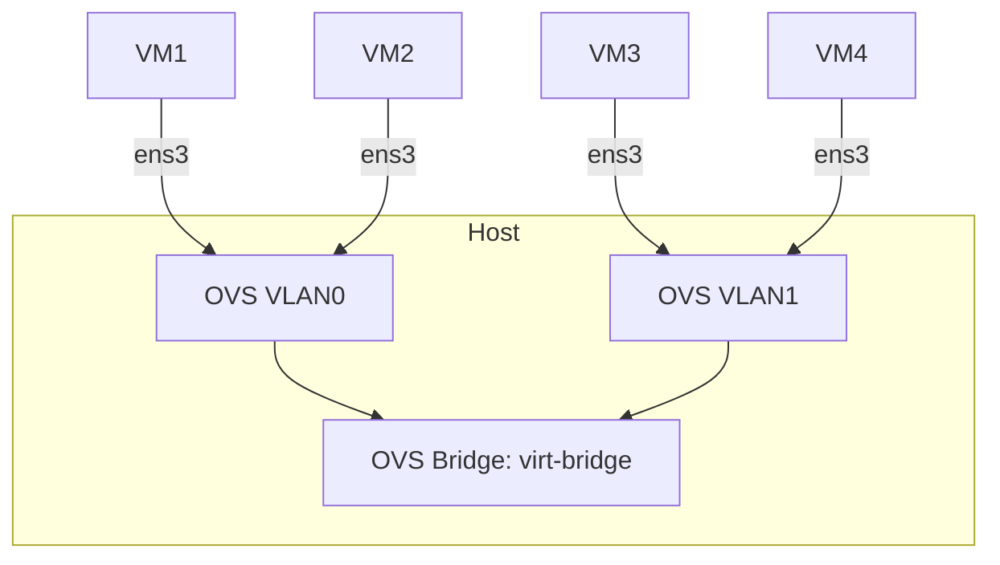

# How to Set Up a Virtual Switch with Multipass

In this tutorial, we will configure a virtual switch (vswitch) for Multipass instances and make them accessible over the network.

## What is a Switch/Bridge and Why Do We Use It?

A switch is a networking device that helps us connect different computers together using ethernet cables. The switch has a MAC table that it uses to determine which computer on the network it is supposed to send data packets to. It is also one of the major component devices of layer 2 of the OSI model.

A bridge is a device that connects two or more local area networks (LANs) that use the same protocol. Bridges act the same way as switches (Virtual Switches in our case).

We are using a bridge here because our VMs are isolated from our host and we need to connect them so that they can talk with each other. A bridge allows the VMs to talk to each other as if they were on the same network.

## Main Functions of a Bridge

- Combines multiple VMs/Containers into a single logical network
- Maintains MAC address table to intelligently forward frames
- Allows devices on the same bridge to communicate directly (except when separated by VLANs)

## Network Topology Overview



## Prerequisites

To follow along in this course, you will need:

- Ubuntu 22.04 LTS or Ubuntu 24.04 LTS
- [Multipass](https://canonical.com/multipass/install) installed
- Root permission or sudo if the user is in the sudoers group
- `ovs-vsctl` installed for creating bridges and adding ports

The Open vSwitch (OVS) supports virtual LAN technology that helps us split our virtual network into smaller logical partitions for security enforcement:

```sh
sudo apt install -y openvswitch-switch
```

## Creating a Virtual Network

After putting in place all the requirements, let's dive in!

### Setting Up the Virtual Switch

First, we will create a Virtual Switch with VLAN support:

```sh
# Create Open Virtual Switch (OVS)
sudo ovs-vsctl add-br virt-bridge
ip link set virt-bridge up # to make it known to your system

# List available bridges
sudo ovs-vsctl list-br

# Configure VLANs on the OVS
sudo ovs-vsctl set port virt-bridge vlan_mode=native-untagged
sudo ovs-vsctl set port virt-bridge trunks=0,1 # to allow VLAN0 and VLAN1
```

### Creating the VMs

Now let's create 4 VMs labeled test-vm1 through test-vm4:

```sh
# Creating VMs with a simple script
for i in {1..4}; do
    multipass launch --name test-vm$i --network name=virt-bridge --network name=default 24.04
done
```

This creates 4 VMs running Ubuntu 24.04.

### Configuring VLAN Tags

Now we'll configure the VLAN tags. VLAN uses the 802.1Q standard, adding a 12-bit tag to L2 packets that can only be decrypted by machines on the same VLAN.

1. First, check available interfaces in your VMs:

    ```sh
    multipass exec "test-vm1" -- ip -o link show | awk -F ': ' '!/lo/ {print $2; exit}'
    # Repeat for other VMs. Use your interface name if not ens3
    ```

2. Add machines to VLAN0:

    ```sh
    multipass stop test-vm1 test-vm2 # stop VMs before adding ports
    sudo ovs-vsctl set port test-vm2-ens3 tag=0
    sudo ovs-vsctl set port test-vm1-ens3 tag=0
    multipass start test-vm1 test-vm2
    ```

3. Add machines to VLAN1:

    ```sh
    multipass stop test-vm3 test-vm4
    sudo ovs-vsctl set port test-vm3-ens3 tag=1
    sudo ovs-vsctl set port test-vm4-ens3 tag=1
    multipass start test-vm3 test-vm4
    ```

4. Verify port settings:

    ```sh
    sudo ovs-vsctl show | grep -A 2 "Port"
    ```

### Network Interface Configuration

Now we'll configure static IP addresses for each VM:

1. For VLAN0 (test-vm1 and test-vm2):

    ```sh
    multipass exec test-vmX -- sudo ip link set ens3 up
    sudo ip addr add 192.168.100.10X dev ens3
    ```

2. For VLAN1 (test-vm3 and test-vm4):

    ```sh
    multipass exec test-vmX -- sudo ip link set ens3 up
    sudo ip addr add 192.168.200.10X dev ens3
    ```

### Testing Connectivity

Let's verify our network configuration:

```sh
# Test connectivity
multipass exec test-vm1 -- ping -c 5 192.168.100.102 # Should work
multipass exec test-vm2 -- ping -c 5 192.168.200.103 # Should not work
```

## Summary

In this tutorial, we have covered:

- Creating a network bridge
- Adding VMs to a network/bridge (always stop instances before attaching)
- Creating and configuring VLANs
- Setting static IPv4 addresses for VM instances
